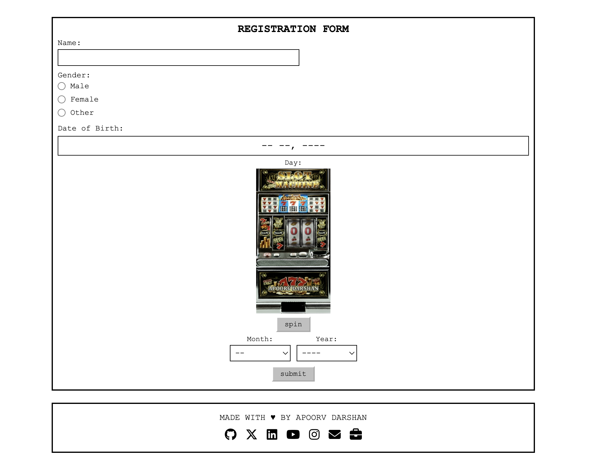

# Slot Machine Date Picker

A retro 90s-style registration form featuring a unique slot machine interface for selecting birth dates. Built for Bad UI Battle with a nostalgic HTML aesthetic.

<div align="center">
  
</div>

## 🎰 Live Demo

**[View Live Demo](https://apoorvdarshan.github.io/slot-machine-date-picker/)**

## Features

- 🎲 Slot machine interface for day selection
- 🔊 Retro sound effects using Web Audio API
- 📱 Fully responsive design
- ⚡ Asset preloading with progress bar
- 🎨 Classic 90s HTML aesthetic

## How It Works

1. Enter your name and select gender
2. Choose month and year from dropdowns
3. **Spin the slot machine** to randomly select your birth day
4. Submit to see your age with fun messages for edge cases

## Technologies Used

- HTML5
- CSS3
- Vanilla JavaScript
- Web Audio API
- Font Awesome Icons

## Installation

1. Clone the repository:
```bash
git clone https://github.com/apoorvdarshan/slot-machine-date-picker.git
```

2. Navigate to the project directory:
```bash
cd slot-machine-date-picker
```

3. Open `index.html` in your browser or use a local server.

## Assets

The project includes custom number images (0-9) and a slot machine background. All assets are preloaded on page load for smooth user experience.

## License

This project is open source and available for anyone to use.

---

<div align="center">

### Made with ❤️ by Apoorv Darshan

[](https://apoorvdarshan.com)
[](https://github.com/apoorvdarshan)
[](https://x.com/apoorvdarshan)
[](https://linkedin.com/in/apoorvdarshan)
[](mailto:ad13dtu@gmail.com)
[](https://youtube.com/@apoorvdarshan)
[](https://instagram.com/apoorvdarshan)

</div>
